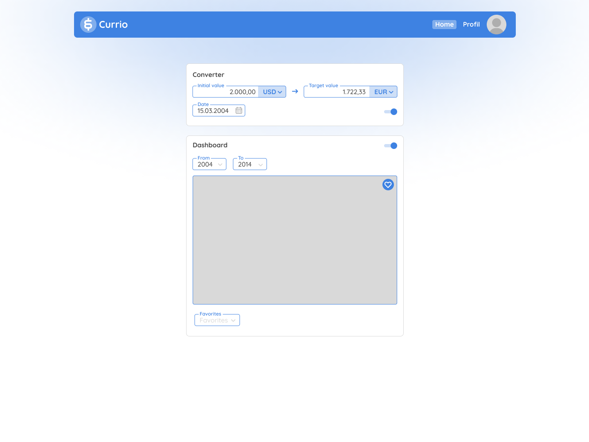
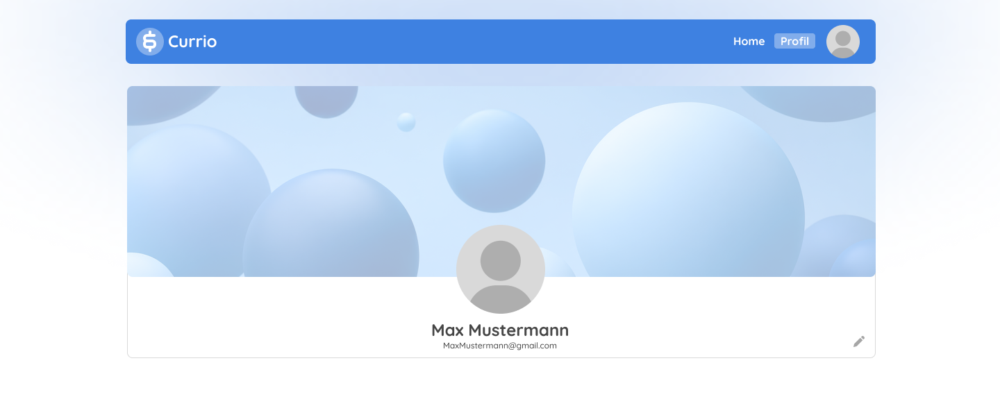
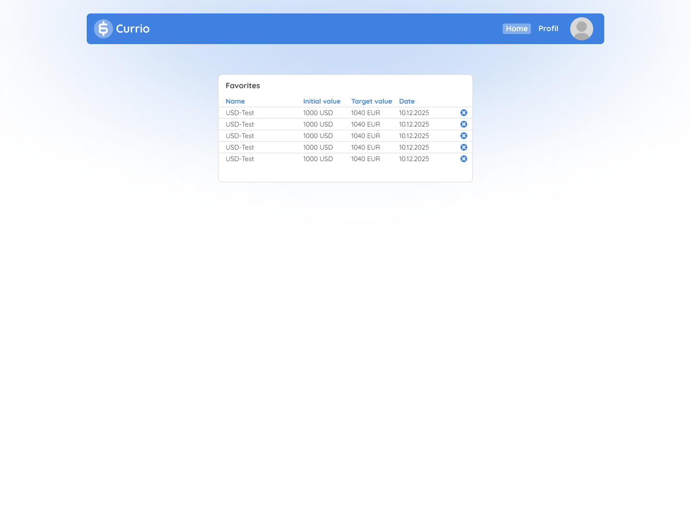
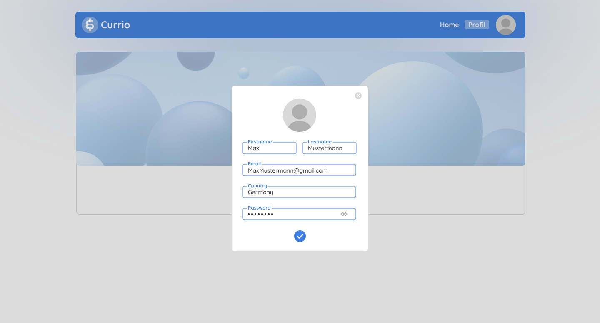

# Exchange Rate Dashboard

## Project Goal

The goal of this project is to develop a full-stack web application using React, TypeScript, Node.js, and MongoDB for displaying current and historical exchange rates.

The backend provides a REST API that retrieves and processes data from an external exchange rate API. Additionally, users can save and manage their favorite currency pairs.

---

## Technologies

### Frontend

- React
- TypeScript
- Material UI (MUI)

### Backend

- Node.js
- Express

### Database

- MongoDB
- MongoDB Atlas (Cloud Hosting)

---

## Planned Features

- Display current exchange rates
- Visualize historical exchange rate trends
- Save favorite currency pairs
- Manage favorites
- Responsive user interface
- User profile management

---

## Application Structure

### Frontend Components

- **Navbar** – Navigation between dashboard, favorites, and profile pages.
- **ConverterCard** – Currency conversion interface with amount and currency selection.
- **CurrencyInput** – Reusable component for currency and amount input.
- **DatePicker** – Selection of dates for historical exchange rate queries.
- **DashboardCard** – Displays exchange rate information and visualizations.
- **FavoriteSelector** – Quick access to saved favorite currency pairs.
- **Profile Page** – Displays user account information.
- **Edit Profile Dialog** – Allows users to update profile information.

### Backend Components

- **Exchange Rate API Service** – Handles communication with the external exchange rate API.
- **Favorites API** – Provides CRUD endpoints for favorite currency pairs.
- **Database Layer** – Stores user information and favorites in MongoDB Atlas.

---

## Data Storage Strategy

- Guest users: Favorites stored in Local Storage.
- Registered users: Favorites and profile data stored in MongoDB Atlas.

---

## Planned Project Workflow

### Milestone 1 – Project Setup

- [x] Create GitHub repository
- [x] Configure Node.js backend
- [x] Configure MongoDB Atlas
- [x] Create initial mockups

### Milestone 2 – Frontend Layout (KW 26-27)

- [x] Initialize React + TypeScript project
- [x] Implement dashboard layout
- [x] Implement navigation bar
- [x] Implement profile page
- [x] Implement edit profile dialog
- [x] Implement responsive design

### Milestone 3 – Frontend Functionality (KW 27)

- [x] Add React Router navigation
- [x] Add React state management
- [x] Implement currency selection
- [x] Implement date selection
- [x] Implement favorites selection

### Milestone 4 – Exchange Rate Integration (KW 27-28)

- [x] Connect external exchange rate API
- [x] Display current exchange rates
- [x] Retrieve historical exchange rates

### Milestone 5 – Data Storage (KW 29-30)

- [x] Implement Local Storage for guest users
- [x] Create favorites model
- [x] Load and manage local favorites
- [x] Store favorites in MongoDB Atlas
- [x] Load and manage cloud favorites

### Milestone 6 – Data Visualization & Deployment (KW 30 - 31)

- [x] Integrate chart library
- [x] Visualize historical exchange rate trends
- [ ] Testing and bug fixing
- [ ] Deployment preparation

---

## Mockups

### Dashboard

Initial concept of the main dashboard featuring currency conversion, historical exchange rate visualization, and favorites management.

### Profile Page

Concept for the user profile page displaying personal account information.

### Favorite Page

Overview of all saved favorite currency pairs. Users can quickly access or remove saved conversions.

### Edit Profile

Concept for the profile editing dialog, allowing users to update personal information and account settings.

